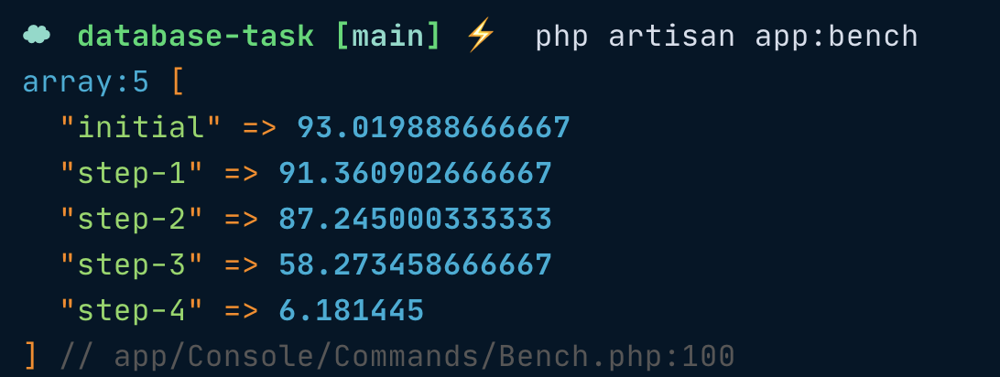

### Task:

There is a process that generates statistics on transactions for different periods:

- 24 hours
- Weekly
- Monthly
- Quarterly
- Year

The query looks like this:

```sql
SELECT
  DATE_FORMAT(CreatedTs, "%Y-%m-%d") `period`,
  StatusId,
  COUNT(idDeal) `count`
FROM Deals
WHERE CreatedTs BETWEEN "2021-01-01 00:00:00" AND "2021-01-31 23:59:59"
GROUP BY 1,
         2;
```

For a while, this query ran quite fast, but as the project evolved, the amount of data in the database increased significantly, which led to a decrease in its performance. What actions should be taken to improve query performance?


### Solution

#### Step Zero

Modified column and table names to better fit Laravel conventions
- CreatedTs -> created_at
- period -> created_date
- StatusId -> status_id
- idDeal -> id
- Deals -> deals

```sql
SELECT
  DATE_FORMAT(created_at, "%Y-%m-%d") `created_date`,
  status_id,
  COUNT(id) `count`
FROM deals
WHERE created_at BETWEEN "2021-01-01 00:00:00" AND "2021-01-31 23:59:59"
GROUP BY 1,
         2;
```

#### Step One

Replace COUNT(id) with COUNT(*)   

```sql
SELECT
  DATE_FORMAT(created_at, "%Y-%m-%d") `created_date`,
  status_id,
  COUNT(*) `count`
FROM deals
WHERE created_at BETWEEN "2021-01-01 00:00:00" AND "2021-01-31 23:59:59"
GROUP BY 1,
         2;
```

### Step Two

use DATE instead DATE_FORMAT

```sql
SELECT
  DATE(created_at) `created_date`,
  status_id,
  COUNT(id) `count`
FROM deals
WHERE created_at BETWEEN "2021-01-01 00:00:00" AND "2021-01-31 23:59:59"
GROUP BY 1,
         2;
```

### Step Three

add created_date generated column
```sql
ALTER TABLE deals ADD COLUMN created_date DATE GENERATED ALWAYS AS (DATE(created_at)) STORED;
```

```sql
SELECT
  created_date,
  status_id,
  COUNT(id) `count`
FROM deals
WHERE created_at BETWEEN "2021-01-01 00:00:00" AND "2021-01-31 23:59:59"
GROUP BY crated_date, status_id;
```

### Step Four

add composite index key on created_date and status_id

```sql
ALTER TABLE deals ADD INDEX created_date_status_id_index (created_date, status_id)
```

## Benchmarks



### Setup 

- install dependencies with `comporser install`
- set your database connection on `.env` file
- import `database/dump.sql` or (`php artisan migrate && php artisan db:seed`)
- run benchmarks with

```bash
php artisan app:bench
```
